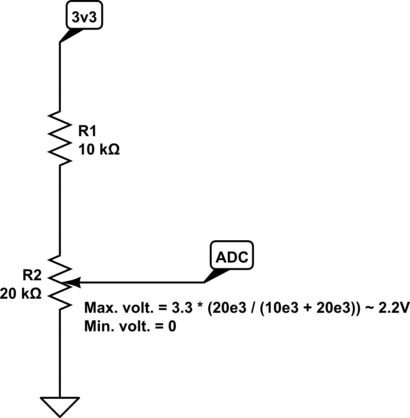
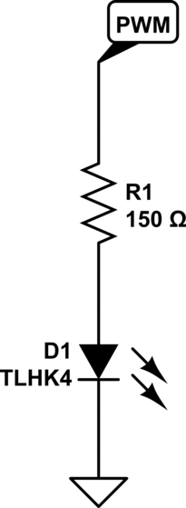
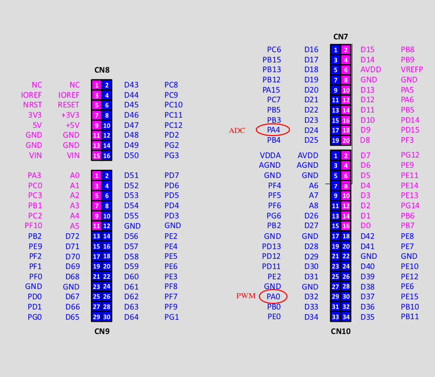

# IRQ driven ADC-to-PWM project

This project is an example application of a nucle-stm32h7 development board that
updates a PWM output based on an ADC input (whose signal is provided by a
potentiometer fed with the MCU's 3.3V), all based on timers and interrupts.

All the peripherals configurations are performed from SM32CubeMX, with a *Nucleo-H753ZI* board.
The parameters not mentioned in this file must be left as default.

## PWM output

The PWM output is located at PA0. It's generated by a timer:

 - The timer period is the PWM period.

 - The timer has an extra register, CCRx, which is a comparator. The output
   signal changes when the timer counter reaches the value in CCRx.

 - The value of this register is constantly being updated based on the value
   read by the ADC.

### Configuration

The timer is configured as following in STM32CubeMX:

Enable the timer by setting its clock source as "Internal Clock". This means its
clock source comes from the MCU clock tree. TIM2 is an APB2 peripheral (see
*Memory map and register boundary addresses* in the H7's datasheet). Hence, in
this example, its clock runs at *64 MHz*.

Select *PWM Generation CH1* in the *Channel1* dropdown list.

In the *Parameter Settings* pane, in *Counter Settings*:

 - In *Prescaler*, set *6399*. The timer "tick frequency" is: clock_source / (prescaler + 1),
   in this case, 64e6 / 64e2 = 1e4 or 10 kHz. The actual value is this +1.

 - In *Counter Period*, set *49*. In the context of a PWM channel, this sets the
   PWM frequency. The actual value is this +1.

 - On *PWM Generation Channel 1*, set:

   - Mode: PWM mode 1. This is a normal PWM.

   - Pulse: 25; sets the duty cycle; more on this below.

   - Output compare preload: Enabled. This means that runtime updates of the PWM
     pulse register (duty cycle) will be buffered and applied in the next PWM
     cycle. In other words, it makes changes to the PWM DC "synchronous" with
     respect to the PWM signal.

    - Fast Mode: Disabled. Not sure what is this for. I think is useful when
      the PWM DC needs to change very quickly and remain accurate; not in this
      case.

    - CH Polarity: High. It means the cycle will start high and will go low
      after, depending on the DC (duty cycle).

### PWM frequency and duty cycle

As explained above, TIM2 (PWM generator) clock source is 64 MHz. With the parameters
above, and recalling that prescaler and counter's values are their set value +1:

$$
f_{timer} = \frac{64 \cdot 10^{-6}}{6400} = 10 \text{ kHz}  \\
T_{timer} = \frac{1}{f_{timer}} = 0.1 \text{ ms}            \\
$$

$$
T_{PWM} = 50 \cdot 0.1 \cdot 10^{-3} = 5 \text{ ms}         \\
f_{PWM} = \frac{1}{T_{PWM}} = 200 \text{ Hz}                \\
$$

About the duty cycle: the *Pulse* (*CCRx* register) establishes at which
counter value the PWM GPIO will toggle. In this case, it's 25; half of the entire
cycle (*Counter Period*). So the duty cycle will be 50%. Notice, however, that
this is just an initial value, as the duty cycle will change at runtime.

## Code

The PWM needs to be started for it to work. To achieve this, call the following
function:

    HAL_TIM_PWM_Start(&htim2, TIM_CHANNEL_1);

## ADC input

The ADC sampling sequences are triggered by a periodic timer. When it has
finished sampling the input, it triggers an interrupt whose ISR is expected to
read the just-fetched value and do something with it.

### Configuration

This section explains how to configure the ADC and its triggering timer.

#### Timer

Enable TIM3 by ticking setting its clock source as *Internal Clock* (64 Mhz, same
as TIM2). Leave all channels disabled. Configure it to have a 100 ms period, that is:

 - Preescaler = 6399
 - Counter Period = 999

In *Trigger Output (TRGO) Parameters*, set the following:

 - Master/Slave Mode (MSM bit): Enable (Trigger delayed for master/slaves simultaneous start)
 - Trigger Event Selection (TRGO): Update Event.

#### ADC module

In the *ADC1* section, enable *IN18* (*PA4*) as *Single Ended*. Configure the *ADC_Settings* as:

 - Clock Preescaler: Asynchronous clock mode divided by 4. See Note 1.

 - Resolution: ADC 8-bit resolution.

 - Overrun behaviour: Overrun data overwritten. This means new ADC values will
   overwrite previous ones if they weren't read in time.

In *ADC_Regular_ConversionMode*, set:

 - Enable regular conversions: Enabled.
 - External Trigger Conversion Source: Timer 3 Trigger Out event.
 - External Trigger Conversion Edge: Trigger detection on rising edge.

In *NVIC Settings*, enable *ADC1 and ADC2 global interrupts*. This is required
for the ADC module to trigger an interrupt when it has new sampled data.

**Note 1**: The ADC clock source frequency is limited, I think to 36 MHz. *ADC1*
is an AHB1 peripheral which, in this example, is fed with a 64 MHz clock. Hence,
use this prescaler to reduce the source frequency, in this case, to 16 MHz (we are
measuring DC, so no high sampling frequency is required).

## Code

Similar than with the PWM, the ADC needs to also be started. This ADC has its
interrupts enabled. Also, it requires calibration, so call the following, in the
same order:

    HAL_ADCEx_Calibration_Start(&hadc1, ADC_CALIB_OFFSET, ADC_SINGLE_ENDED);
    HAL_ADC_Start_IT(&hadc1);

## ADC input to PWM output

As per the description, the MCU is supposed to read the ADC and update the PWM
duty cycle in consonance, using interrupts to do so.

To achieve that, implement the *__weak* function *void HAL_ADC_ConvCpltCallback(ADC_HandleTypeDef *hadc)*
so that it reads the ADC value with *HAL_ADC_GetValue*, performs whatever conversion from raw ADC to
duty cycle is required, and updates the PWM duty cycle by updating its *CCRx* regiser, with
*__HAL_TIM_SET_COMPARE(&htim2, TIM_CHANNEL_1, ${value})*.

### Parsing the ADC raw input to the PWM output

The ADC raw input is 8 bits, so it can take value within [0, 255]. Also, the ADC's
input voltage range is [0, 3.3] as can be seen in the *STM32H753xI* datasheet, in
*Electrical characteristics (rev Y)* > *Operating COnditions* > *16-bit ADC characteristics*, parameter
$V_{DDA}$.

## Extra: blink a LED when the PWM duty cycle is 100%

This application also blinks an LED when the PWM is set to 100%.

:warning: This didn't work very well when tested, as it was difficult to reach
actual 100% duty cycle due to a not-very-accurately calculated ADC input signal and
ADC raw value parsing. Still, if configured to blink whenever the DC is higer than,
say, 80%, it should work pretty well.

### Configuration

A timer will be configured to toggle a LED every 0.5 s:

Enable TIM6 (it's a basic timer, so it has less options than TIM8) by ticking
*Activated*. Configure it to have a 500 ms period, that is:

 - Preescaler = 6399
 - Counter Period = 4999

Same reasoning as above applies: 5e3 * (1 / (64e6 / 64e2)) = 500 ms.

In the *NVIC settings* tab, enable the TIM6 global interrupt.

### Code

Implement the *__weak* function *void HAL_TIM_PeriodElapsedCallback(TIM_HandleTypeDef *htim)*
so that it blinks the LED, or sets it zero, as required.

## Build and flash

This is a *Makefile* project, so do:

    make -j $(nproc)

To flash, the tool st-link can be used, but it requires installation:

    sudo apt install stlink-tools

Then:

    st-flash write $BUILD/$interrupts_test.bin 0x8000000

## The circuit

This section explains the circuit used to test this application.

### ADC input

The ADC input has a valid range of [0, 3.3] V. For safety, and to avoid potential
non-linearities, set the circuit to have a range of about [0, 2.2] (although 0
can incur in non-linearities also).

To achieve this user a 10 kOhm resistor in series with a 20 kOhm resistor, so
the highest voltage reachable os ~2.2 V.

Circuit:

### PWM output

Connect a TLHK4 LED to show the PWM acting. Its maximum current is 30 mA, so use
a current-limiting resistor of 3.3 / 150 = 22 mA.

Circuit:

## Dev. board

The connections to the board (see initial description) are as following:

